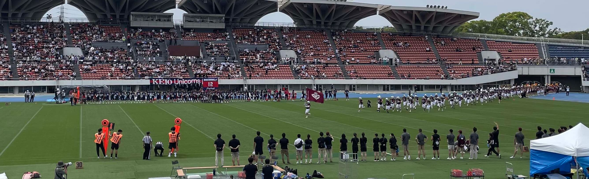

早稲田大学のアメリカンフットボール場を拠点に活動しているフラッグフットボール（flag football）のクラブチームです。NPO法人WASEDA CLUBが運営しています。

幼児・小学生・中学生・高校生以上の男女100名以上で活動しています。

<!-- NPO法人ワセダクラブ フラッグフットボールスクールの活動記録。東京都西東京市東伏見の早稲田大学グランドを中心に幼児・小学生・中学生から大人まで100名以上で活動中 -->

対象者（性別不問）
-------------------

* 幼児（年少～年長）
* 小学生
* 中学生
* 高校生以上
  - 2023年度より「シニアベアーズ」として活動開始。社会人リーグ「F League」1部参戦開始

活動日
---------

* 毎週日曜日午前中（幼児クラスは月2~3回）
  - グラウンド使用の調整の関係により活動日が土曜日になる場合や時間を変更することもあります。
* 公式戦、練習試合などの場合は土・日・祝日もあります
* 詳細は[こちら](/schedule.html)を参照ください。

活動場所
---------

早稲田大学東伏見運動場「アメリカンフットボールグラウンド」
 (西武新宿線東伏見駅 徒歩2分)

会費
---------

2,000円/月　（年間20,000円　スポーツ傷害保険料含む）
  - ※この他に、スクール生の保護者の方にはワセダサポーターズクラブ（年会費：5,000円）に入会していただきます。

無料体験
---------------------------

生徒氏名（ふりがな）・学年を明記のうえ、下記までメールでお申し込みください。

[flagfootball@wasedaclub.com](mailto:flagfootball@wasedaclub.com)

お問い合わせ
----------------------------------------------------

### NPO法人ワセダクラブ事務局
〒167-0023
東京都杉並区上井草3-32-6伊地知ビル１F
TEL： 03-3301-5930

### フラッグフットボール専用メールアドレス
[flagfootball@wasedaclub.com](mailto:flagfootball@wasedaclub.com)

お知らせ （X （旧Twitter））
-------------------------
<a class="twitter-timeline" href="https://twitter.com/wasedaflag?ref_src=twsrc%5Etfw">Tweets by wasedaflag</a> 

